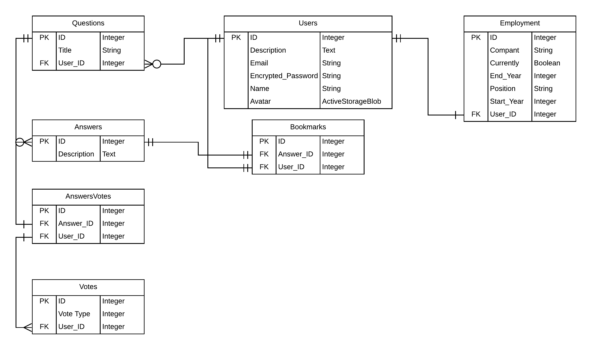
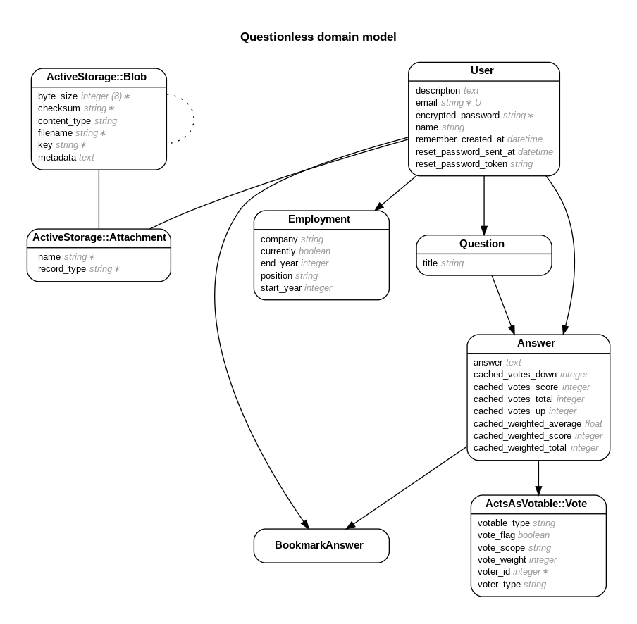

# Questionless

#### Coder Academy Hackathon

*Team Members: Ross Baker, Anh (Duke) Nguyen, Morgan Batterham*

Questionless is a question and answer exchange based on [Quora](https://www.quora.com/) built with Ruby on Rails. It's core functionality is for users to ask questions and receive answers. There are a number of features which allow for a rich and dynamic user experience listed below.

##### Features

- Ask questions.
- Tag your questions.
  - When asking a question you can tag it with relevant keywords.
  - You can filter questions based on their tags.
- Answer other users questions.
- Voting system.
  - As a user you can vote on answers with an upvote or a downvote. This feature allows your answers feed to be sorted by the most popular answers.
- Bookmark answers.
  - If you find an answer you want to return to later, you can bookmark it for easy navigation later on.
- User profiles.
  - As a user you can edit your profile with relevant information about yourself.
  - [TODO] As a user you can follow other users and get notified of their activity.
- [TODO] Messaging.
  - As a user you can send messages to other users.

##### Development

To get started with development:

Fork this repository.

Clone to your local machine.

Install the required dependencies `bundle install` 

Create the database `rails db:create`

Migrate the database rails `rails db:migrate`

Seed the database `rails db:seed`

Run the local server `rails s`

The site should now be running on your local server.

##### Architecture & Models

 

